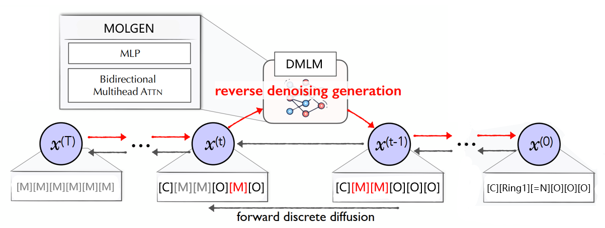

# DMLM: A Diffusion Molecular Language Model for SELFIES Generation
## 基于扩散语言模型的SELFIES分子生成方法

  

---

### Introduction

This project is the code implementation for the thesis **Research on Molecular Generation Methods Based on Diffusion Language Models**。

Traditional molecular generation methods, when dealing with 1D string representations like SMILES or SELFIES, often employ **Autoregressive** models (such as RNNs or Transformer decoders). These models generate tokens sequentially, assuming that the generation of the current token strictly depends on its preceding sequence. However, a molecule's chemical structure is inherently a graph, where dependencies between atoms are global and non-local. When this structure is forcibly mapped into a linear sequence, its intrinsic dependencies become complex and **Non-Autoregressive**. The conventional left-to-right generation approach struggles to effectively capture the molecule's overall topology and long-range constraints (like ring closures).

To address this challenge, we propose a new non-autoregressive paradigm for molecular generation—**DMLM (Diffusion Molecular Language Model)**. Our core idea is:

-   **Abandon Autoregression, Embrace Iterative Global Generation**: Instead of generating tokens one by one, we treat the entire molecular sequence as a whole. Using the framework of diffusion models, the model starts from a completely noised sequence (all [MASK]) and, through multiple iterative steps, refines and denoises all positions in the sequence **in parallel and globally** until the complete SELFIES molecular string is recovered. This iterative, global generation process better aligns with the holistic nature of molecular structures and can better capture their non-local dependencies.

-   **Inspired by DiffusionBERT**: Our method is inspired by the success of **DiffusionBERT** in the text generation domain. DiffusionBERT demonstrated that diffusion models can serve as powerful non-autoregressive text generators. We successfully transfer this idea to the molecular generation field and design key modules adapted to the characteristics of SELFIES:
    -   **Spindle Noise Schedule**: Denoising is performed differentially based on the information content of SELFIES tokens.
    -   **Time-Agnostic Decoding**: Simplifies model design and efficiently utilizes pre-trained knowledge.
      
-   **Integrating MOLGEN Pre-trained Knowledge**: We use the powerful pre-trained model **MOLGEN** as the core denoising network. Its bidirectional contextual understanding capability is key to achieving global parallel denoising.

Experiments show that DMLM performs exceptionally well on the MOSES benchmark dataset, achieving SOTA (State-Of-The-Art) levels in validity, novelty, uniqueness, and stability, validating the effectiveness of the non-autoregressive generation paradigm.

### 简介 

本项目是论文 **《基于扩散语言模型的分子生成方法研究》** 的代码实现。

传统的分子生成方法在处理如SMILES或SELFIES等一维字符串表示时，常采用**自回归 (Autoregressive)** 模型（如RNNs或Transformer解码器）。这类模型逐个生成符号，并假设当前符号的生成严格依赖于其前序序列。然而，分子的化学结构本质上是一个图，其原子间的依赖关系是全局的、非局部的。将这种结构强行映射为线性序列后，其内在的依赖关系变得复杂且**非自回归 (Non-Autoregressive)**，传统的从左到右的生成方式难以有效捕捉分子的整体拓扑结构和长程约束（如环的闭合）。

为应对这一挑战，我们提出了一种**非自回归的分子生成新范式——DMLM (Diffusion Molecular Language Model)**。我们的核心思想是：

-   **放弃自回归，拥抱迭代式全局生成**：我们不逐个生成符号，而是将整个分子序列视为一个整体。通过**扩散模型**的框架，模型从一个完全噪声化的序列（全`[MASK]`）开始，通过多步迭代，**并行地、全局地**对序列中的所有位置进行细化和去噪，直至恢复出完整的SELFIES分子串。这种迭代式的全局生成过程更符合分子结构的整体性，能更好地捕捉其非局部依赖。

-   **借鉴 DiffusionBERT 思想**：我们的方法受到了 **DiffusionBERT** 在文本生成领域成功的启发。DiffusionBERT证明了扩散模型可以作为一种强大的非自回归文本生成器。我们将这一思想成功迁移到分子生成领域，并设计了适配SELFIES特性的关键模块：
    -   **纺锤形噪声调度 (Spindle Noise Schedule)**：根据SELFIES符号的信息量差异化地进行去噪。
    -   **时间无关解码 (Time-Agnostic Decoding)**：简化模型设计，高效利用预训练知识。

-   **融合 MOLGEN 预训练知识**：采用强大的预训练模型 **MOLGEN** 作为核心去噪网络，其双向上下文理解能力是实现全局并行去噪的关键。

实验证明，DMLM 在 MOSES 基准数据集上表现出色，在有效性、新颖性、唯一性和稳定性方面均达到了SOTA水平，验证了非自回归生成范式的有效性。

